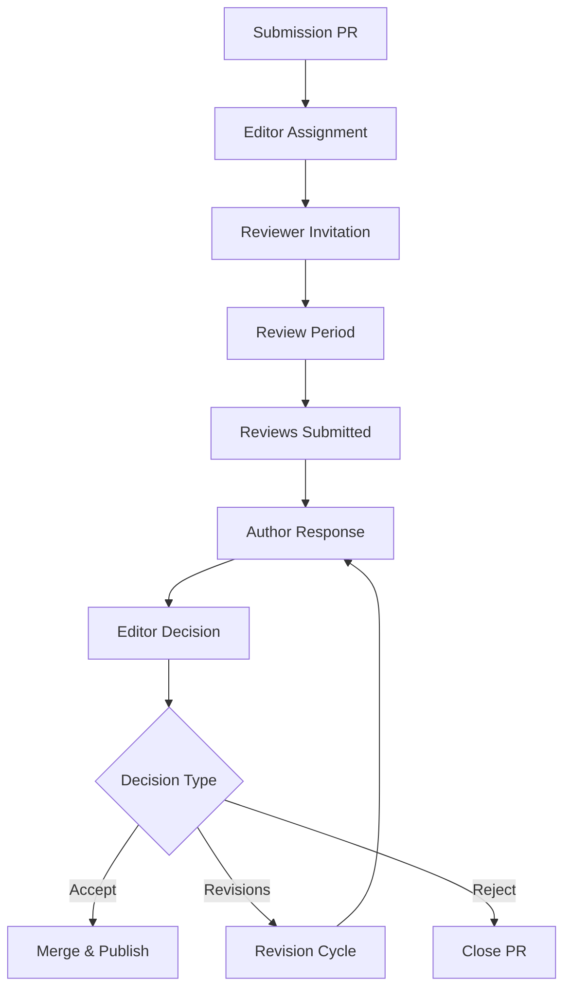

# Evaluation Framework for Reviewers

This document provides the structured framework for evaluating institutional submissions. Reviewers should complete this evaluation for each assigned submission.

## Review Template

Copy this template to create your review document at `reviews/[your-name].md`:

```markdown
# Review of [Institution Name]

**Reviewer**: [Your Name]
**Date**: [YYYY-MM-DD]
**Recommendation**: [Accept/Minor Revisions/Major Revisions/Reject]

## Completeness Assessment

**All questions answered?** [Yes/No/Mostly]
- Missing questions: [List any]
- Acknowledged gaps: [Note explanations]

## Answer Quality

**Question 1 (Purpose)**: [Clear/Adequate/Unclear]
- Comments:

**Question 2 (Stakeholders)**: [Clear/Adequate/Unclear]
- Comments:

**Question 3 (Environment)**: [Clear/Adequate/Unclear]
- Comments:

**Question 4 (Constitution)**: [Clear/Adequate/Unclear]
- Comments:

**Question 5 (Field Sites)**: [Clear/Adequate/Unclear]
- Comments:

**Question 6 (Author Relationship)**: [Clear/Adequate/Unclear]
- Comments:

**Question 7 (Founding)**: [Clear/Adequate/Unclear]
- Comments:

**Question 8 (Evolution)**: [Clear/Adequate/Unclear]
- Comments:

**Question 9 (References)**: [Clear/Adequate/Unclear]
- Comments:

## Overall Evaluation

### Strengths
- [List major strengths of the documentation]

### Weaknesses
- [List areas needing improvement]

### Verifiability
**Can claims be verified?** [Yes/Partially/No]
- Functional references: [Yes/No]
- Evidence quality: [Strong/Adequate/Weak]
- Comments:

### Vitality
**Is this a living institution?** [Yes/Potentially/No]
- Active participants: [Yes/No]
- Adaptation evidence: [Yes/No]
- Future viability: [Likely/Uncertain/Unlikely]
- Comments:

## Specific Suggestions

[Provide actionable feedback for improvement]

## Additional Comments

[Any other observations or recommendations]
```

## Review Process Flow



## Evaluation Timeline

- **Day 1-3**: Editor reviews submission and assigns reviewers
- **Day 4-17**: Reviewers evaluate submission (2 weeks)
- **Day 18-20**: Editor synthesizes reviews
- **Day 21-35**: Author revisions if needed (2 weeks)
- **Day 36-40**: Final decision and publication

## Reviewer Guidelines

### Before Reviewing

1. **Check for conflicts of interest**:
   - Direct involvement with the institution
   - Competitive relationships
   - Personal relationships with authors

2. **Confirm your expertise**:
   - Familiar with institutional type
   - Understand relevant context
   - Can evaluate technical claims

### During Review

1. **Read completely** before evaluating
2. **Take notes** on each section
3. **Check references** for key claims
4. **Consider institutional diversity** - avoid imposing single model
5. **Provide constructive feedback** - help improve documentation

### Quality Indicators

**Strong Documentation Shows**:
- Concrete operational details
- Clear stakeholder relationships
- Honest assessment of limitations
- Rich references and evidence
- Evolutionary capacity

**Weak Documentation Shows**:
- Vague generalities
- Unsubstantiated claims
- Missing stakeholder perspectives
- Broken or irrelevant references
- Static or declining activity

## Decision Criteria

### Accept
- Satisfies all core criteria
- Provides valuable institutional knowledge
- References verify claims
- Clearly living institution
- Minor improvements only

### Minor Revisions
- Satisfies most criteria
- Specific gaps identified
- Easy to address issues
- Strong potential value
- Single revision cycle expected

### Major Revisions
- Significant criteria gaps
- Substantial improvements needed
- Multiple revision cycles likely
- Potential value evident
- Authors show commitment

### Reject
- Fundamental criteria failures
- Not a living institution
- Unverifiable claims
- Outside journal scope
- Quality below standards

## Reviewer Recognition

Reviewers contribute essential labor to the commons. Recognition includes:
- Named acknowledgment in published submissions
- Annual reviewer appreciation
- Invitation to editorial board (active reviewers)
- Co-authorship opportunities on methodology papers

## Ethical Considerations

### Confidentiality
- Don't share submissions outside review process
- Keep reviewer discussions private
- Respect sensitive institutional information

### Constructive Approach
- Focus on improving documentation
- Acknowledge institutional diversity
- Provide specific, actionable feedback
- Separate documentation quality from institutional judgment

### Timeliness
- Meet review deadlines
- Communicate delays promptly
- Prioritize responsiveness to authors

## Appeals Process

Authors who disagree with decisions may:
1. Respond to reviews in PR comments
2. Request additional reviewer
3. Appeal to editorial board
4. Propose process improvements

All appeals handled transparently in public PRs.

## Continuous Improvement

Help improve the evaluation process:
- Suggest criteria refinements
- Share review experiences
- Propose process improvements
- Contribute to methodology discussions

Your reviews shape both individual submissions and the journal's evolution. Thank you for your contribution to the institutional knowledge commons!